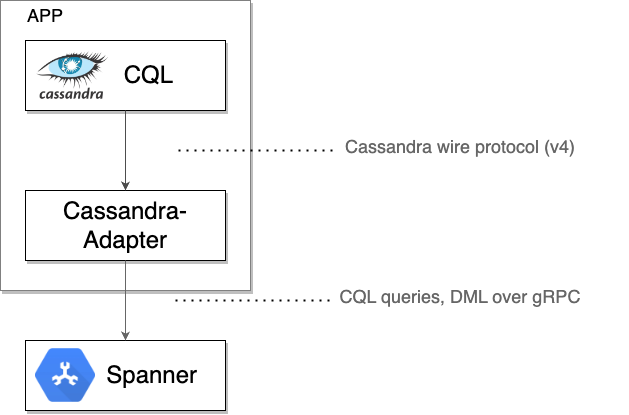
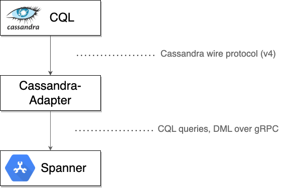

# Spanner Cassandra Java Client

## Current Released Version in Public Preview

<!--- {x-version-update-start:google-cloud-spanner-cassandra:released} -->
Version `0.3.0`
<!--- {x-version-update-end} -->

## Introduction
The **Spanner Cassandra Java Client** is a tool designed to bridge applications written for the Apache Cassandra® database with Google Spanner. With Spanner's native support for the Cassandra v4 wire protocol, this client allows Java applications or even non-Java applications and tools such as `cqlsh`, to connect seamlessly to a Cloud Spanner database.

This client acts as a local tcp proxy, intercepting the raw Cassandra protocol bytes sent by a driver or client tool. It then wraps these bytes along with necessary metadata into gRPC messages for communication with Spanner. Responses from Spanner are translated back into the Cassandra wire format and sent back to the originating driver or tool.



## Table of Contents

- [When to use java-spanner-cassandra?](#when-to-use-spanner-cassandra-java-client)
- [Prerequisites](#prerequisites)
- [Spanner Instructions](#spanner-instructions)
- [Getting started](#getting-started)
  - [In-Process Dependency](#in-process-dependency-recommended)
  - [Sidecar Proxy](#sidecar-proxy)
- [Supported Cassandra Versions](#supported-cassandra-versions)
- [Unsupported Features](#unsupported-features)
- [License](#license)

## When to Use Spanner Cassandra Java Client?

This client is useful but not limited to the following scenarios:

* **Leveraging Spanner with Minimal Refactoring:** You want to use Spanner as the backend for your Java application but prefer to keep using the familiar `cassandra-java-driver` API for data access.
* **Using Non-Java Cassandra Tools:** You want to connect to Spanner using standard Cassandra tools like `cqlsh` or applications written in other languages that use Cassandra drivers.

## Prerequisites

You will need a [Google Cloud Platform Console][developer-console] project with the Spanner [API enabled][enable-api].
You will need to [enable billing][enable-billing] to use Google Spanner.
[Follow these instructions][create-project] to get your project set up.
Java Development Kit (JDK) 8 or later.
[Maven][apache-maven] or [Gradle][gradle] for dependency management.

Ensure that you run

```sh
gcloud auth application-default login
```

to set up your local development environment with authentication credentials.

Set the GCLOUD_PROJECT environment variable to your Google Cloud project ID:

```sh
gcloud config set project [MY_PROJECT_NAME]
```

## Spanner Instructions

- Database and all the tables should be created in advance before executing the queries using the adapter.
- To migrate existing Cassandra schema to corresponding Spanner schema, refer to [our official Cassandra to Spanner migration tool][cassandra-spanner-migration-tool] to automate this process.

## Getting Started

You can use `spanner-cassandra` in two main ways: as an **in-process dependency** within your Java application, or as a standalone **sidecar proxy** for other applications and tools.

* **In-Process Dependency:** Choose this method if you have a Java application already using `cassandra-java-driver` and want the adapter to run within the same process, providing a seamless switch to Spanner with minimal code modifications.
* **Sidecar Proxy:** Choose this method if your application is not written in Java, or if you want to use external Cassandra tools (like `cqlsh`) without modifying the application's code. The adapter runs as a separate process, intercepting network traffic.

### In-Process Dependency (Recommended)

For Java applications already using the `cassandra-java-driver` library, integrating the Spanner Cassandra Java Client requires only minor changes to the CqlSession initialization.

**Steps:**

*   Add the dependency to your project's build file:

    **Maven:**

    <!--- {x-version-update-start:google-cloud-spanner-cassandra:released} -->
    <!-- [START spanner_cassandra_maven_dependency] -->
    ```xml
    <dependency>
        <groupId>com.google.cloud</groupId>
        <artifactId>google-cloud-spanner-cassandra</artifactId>
        <version>0.3.0</version>
    </dependency>
    ```
    <!-- [END spanner_cassandra_maven_dependency] -->
    <!--- {x-version-update-end} -->

    **Gradle:**

    <!--- {x-version-update-start:google-cloud-spanner-cassandra:released} -->
    <!-- [START spanner_cassandra_gradle_dependency] -->
    ```gradle
    dependencies {
        implementation 'com.google.cloud:google-cloud-spanner-cassandra:0.3.0'
    }
    ```
    <!-- [END spanner_cassandra_gradle_dependency] -->
    <!--- {x-version-update-end} -->

*  Modify your `CqlSession` creation code. Instead of using `CqlSessionBuilder`, use `SpannerCqlSessionBuilder` and provide the Spanner database URI:

    ```java
    CqlSession session =
        SpannerCqlSession.builder() // `SpannerCqlSession` instead of `CqlSession`
            .setDatabaseUri("projects/your_gcp_project/instances/your_spanner_instance/databases/your_spanner_database") // Required: Specify the Spanner database URI
            .withKeyspace("your_spanner_database") // Your Spanner database ID is mapped to a keyspace
            .withConfigLoader(
                DriverConfigLoader.programmaticBuilder()
                    .withString(DefaultDriverOption.PROTOCOL_VERSION, "V4") // Set protocol version.
                    .withDuration(
                        DefaultDriverOption.CONNECTION_INIT_QUERY_TIMEOUT,
                        Duration.ofSeconds(5)) // Set connection initialization timeout.
                    .build())
            .build();

    // Rest of your business logic such as session.Query(SELECT * FROM ...)

    session.close();

    ```

*  Run your Java application as usual. The adapter will now route traffic to your Spanner database.

### Sidecar Proxy



For non-Java applications or tools like `cqlsh`, you can run the Spanner Cassandra Java Client as a standalone proxy.

**Steps:**

* Clone the repository:

    ```bash
    git clone https://github.com/googleapis/java-spanner-cassandra.git
    cd java-spanner-cassandra
    ```

* Build the project by running:

    ```bash
    mvn clean install
    ```

    This will create an executable jar file `spanner-cassandra-launcher.jar` inside the folder `spanner-cassandra-launcher/target`.

* Run the jar using the command:

    ```bash
    java -DdatabaseUri=projects/my-project/instances/my-instance/databases/my-database \
    -Dhost=127.0.0.1 \
    -Dport=9042 \
    -DnumGrpcChannels=4 \
    -jar path/to/your/spanner-cassandra-launcher.jar
    ```

    * Replace the value of `-DdatabaseUri` with your Spanner database URI.
    * You can omit `-Dhost` to use the default `0.0.0.0`, omit `-Dport` to use the default `9042`, and omit `-DnumGrpcChannels` to use the default `4`.

## Supported Cassandra Versions

By default, Spanner Cassandra client communicates using the [Cassandra 4.0 protocol](https://github.com/apache/cassandra/blob/trunk/doc/native_protocol_v4.spec) and is fully tested and verified with **Cassandra 4.x**, providing complete support. For **Cassandra 3.x**, the client is designed to be compatible and should work seamlessly, though we recommend thorough testing within your specific setup.

## Unsupported Features

* named parameters
* pagination
* unset parameter value

## License

[Apache License 2.0](LICENSE)

[developer-console]: https://console.developers.google.com/
[enable-api]: https://console.cloud.google.com/flows/enableapi?apiid=spanner.googleapis.com
[enable-billing]: https://cloud.google.com/apis/docs/getting-started#enabling_billing
[create-project]: https://cloud.google.com/resource-manager/docs/creating-managing-projects
[cloud-cli]: https://cloud.google.com/cli
[apache-maven]: https://maven.apache.org/
[gradle]: https://gradle.org/
[cassandra-spanner-migration-tool]: https://github.com/cloudspannerecosystem/spanner-cassandra-schema-tool
